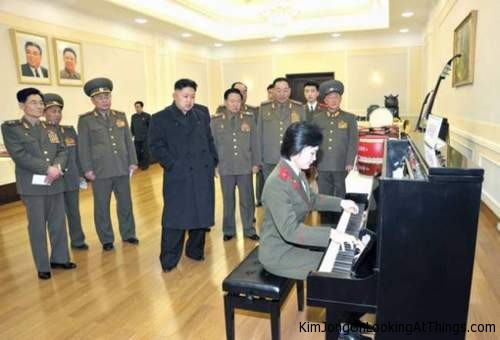

# kim-jong-un-dataset

This is a dataset containing labelled images of Supreme Leader Kim Jong Un looking at objects, labelled with the name of the object(s) he is staring at. Different images of Kim Jong Un staring at identical objects are appended with `-2` or `-3`. Any contributions are appreciated.

**EDIT**: Now also contains images of Kim Jong-Il. These can be found in the *kimgjongil*-folder. They were scraped from [Kim Jong-Il looking at things](https://kimjongillookingatthings.tumblr.com/).

A few examples:

### clams

### mushrooms

### tiles

### piano

